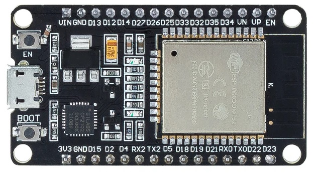
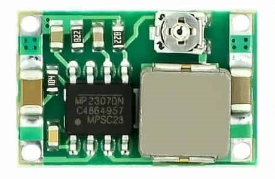
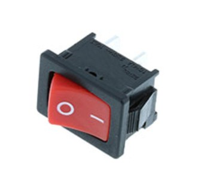
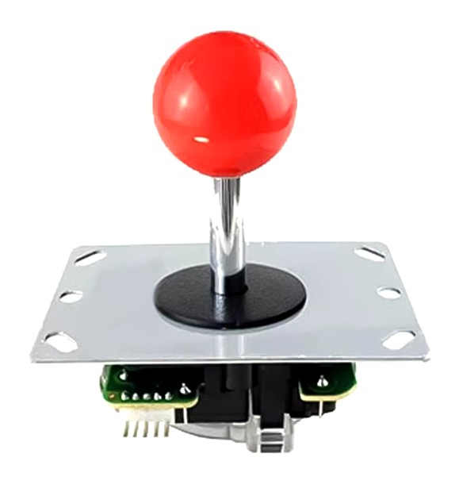
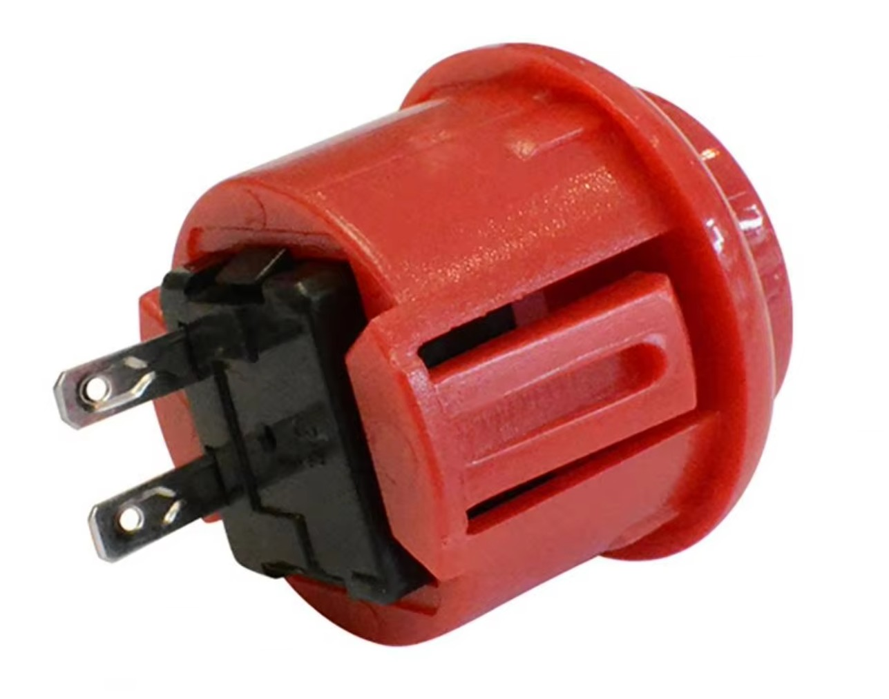
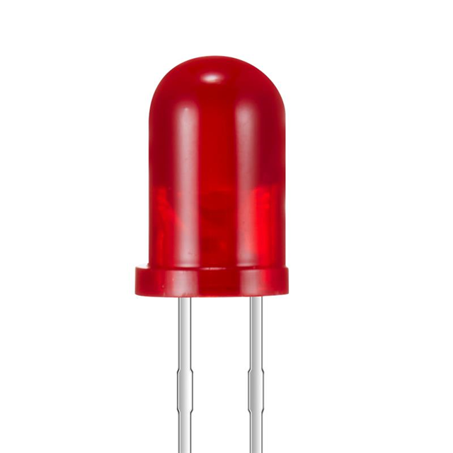
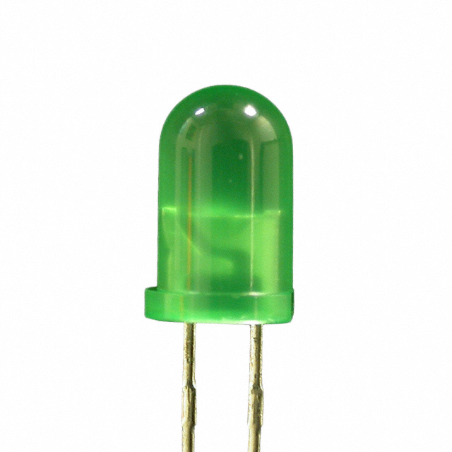
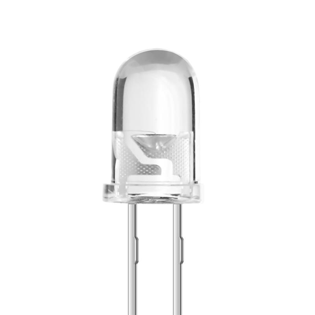
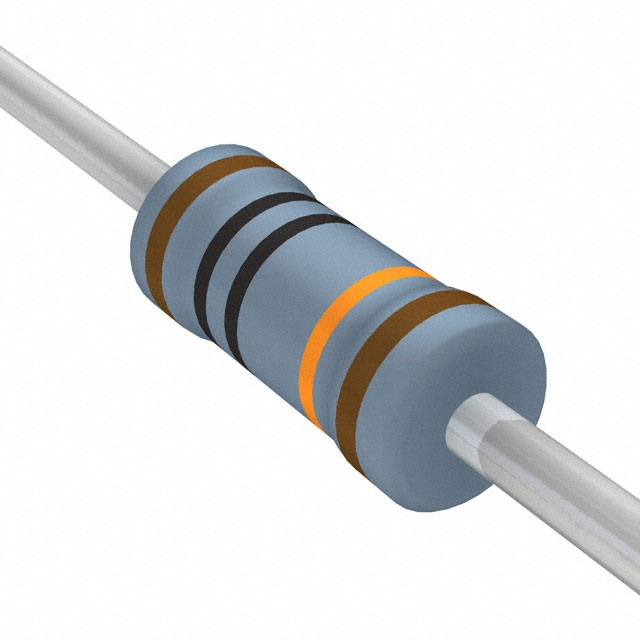
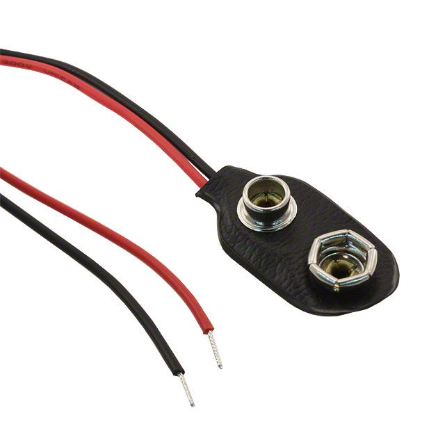

# Arcade Remote

## Introduction

A retro-style arcade controller for robots, built using ESP32 and Arduino.

## Electronics

| Name                       | Thumbnail                                                                | Required          | Note      |
| -------------------------- | ------------------------------------------------------------------------ | ----------------- | --------- |
| ESP32 Dev Module           |                   | 1                 |           |
| Mini 360 DC-DC step down   |               | 1                 | 5V output |
| Switch                     |                 | 1                 |           |
| Joystick                   |             | 1                 |           |
| Push button                |       | 5                 |           |
| Red LED                    |               | 1                 |           |
| Green LED                  |           | 1                 |           |
| White LED                  |           | 4                 |           |
| 100k resistor              |   | 6                 |           |
| 9V battery connector       |   | 1         |           |
| 9V battery                 |         | 1                 |           |

### Connection Diagram

## 3D-Printed Parts

| Filename       | Thumbnail                                                               | Required |
| -------------- | ----------------------------------------------------------------------- | -------- |
| arcade body    |      | 1        |
| arcade cover   |    | 1        |
| battery cover  |  | 1        |

## Other Parts

| Name      | Spec    | Required | Installation |
| --------- | ------- | -------- | ------------ |
| Screw     | M3 10mm | 10       | Cover and body |
| Screw     | M4 10mm | 4        | Joystick |
| Nuts      | M3      | 10       | Cover and body |
| Nuts      | M4      | 4        | Joystick |
| Standoffs | M2 Male Female Hex 4mm | 4        | Connect ESP32 to body |
| Screw     | M2 4mm  | 4        | Connect ESP32 to body |
| Magnets   | 5mm (diameter) x 2mm (thickness) | 8        | Hold battery cover |
