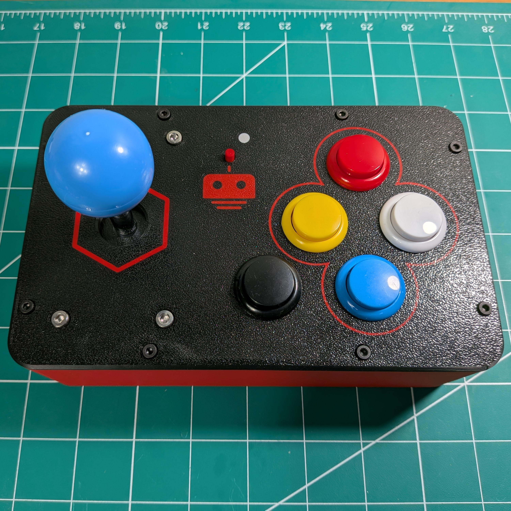
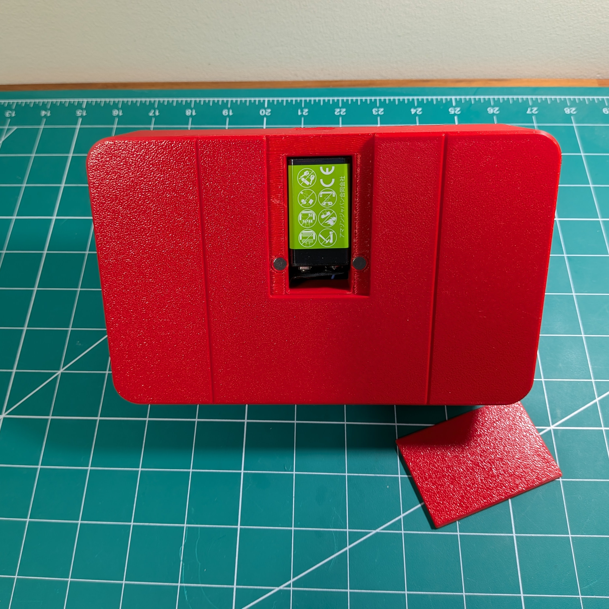
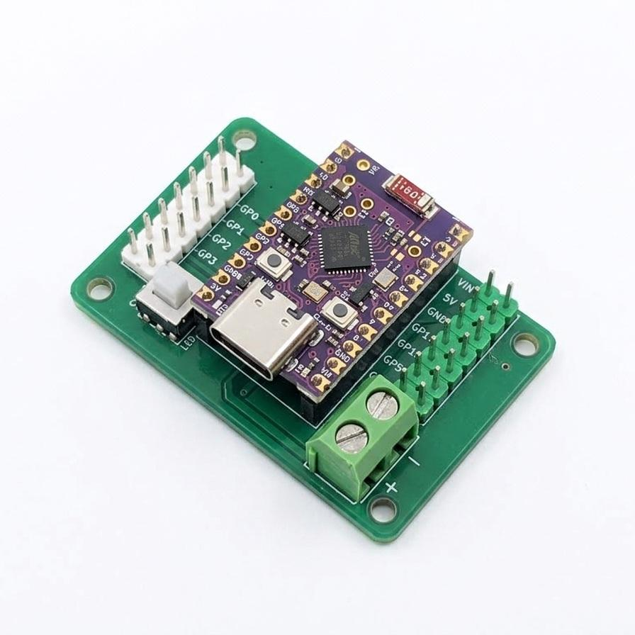
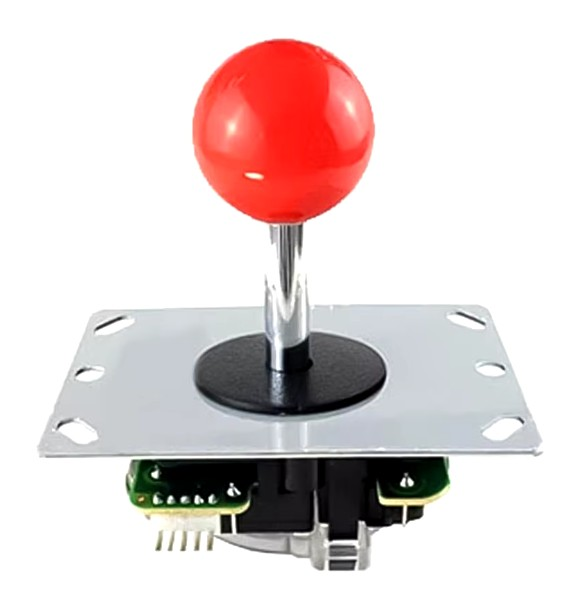
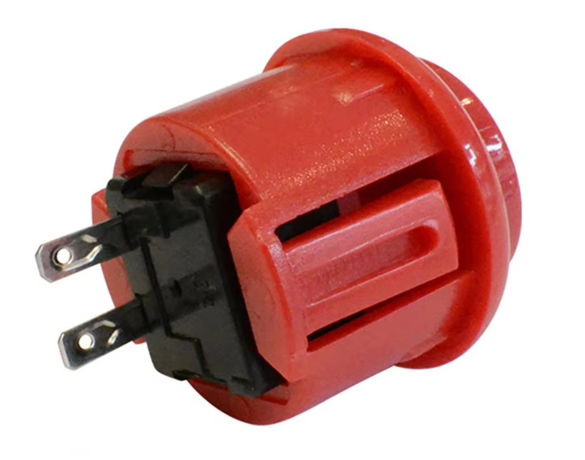
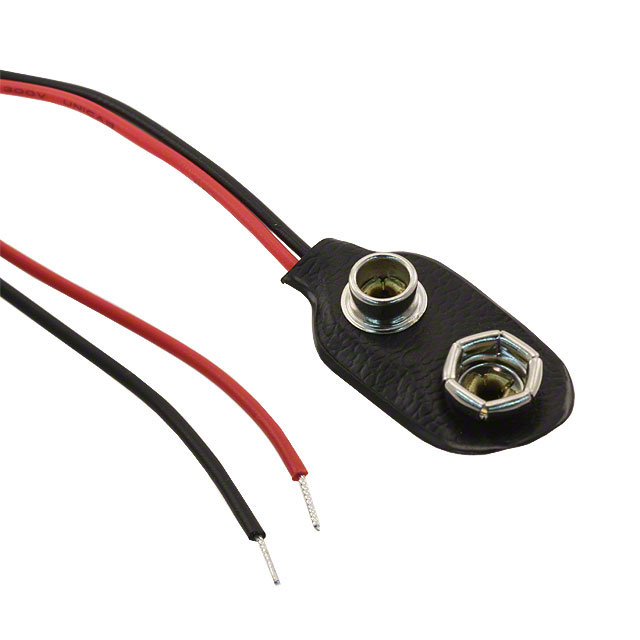
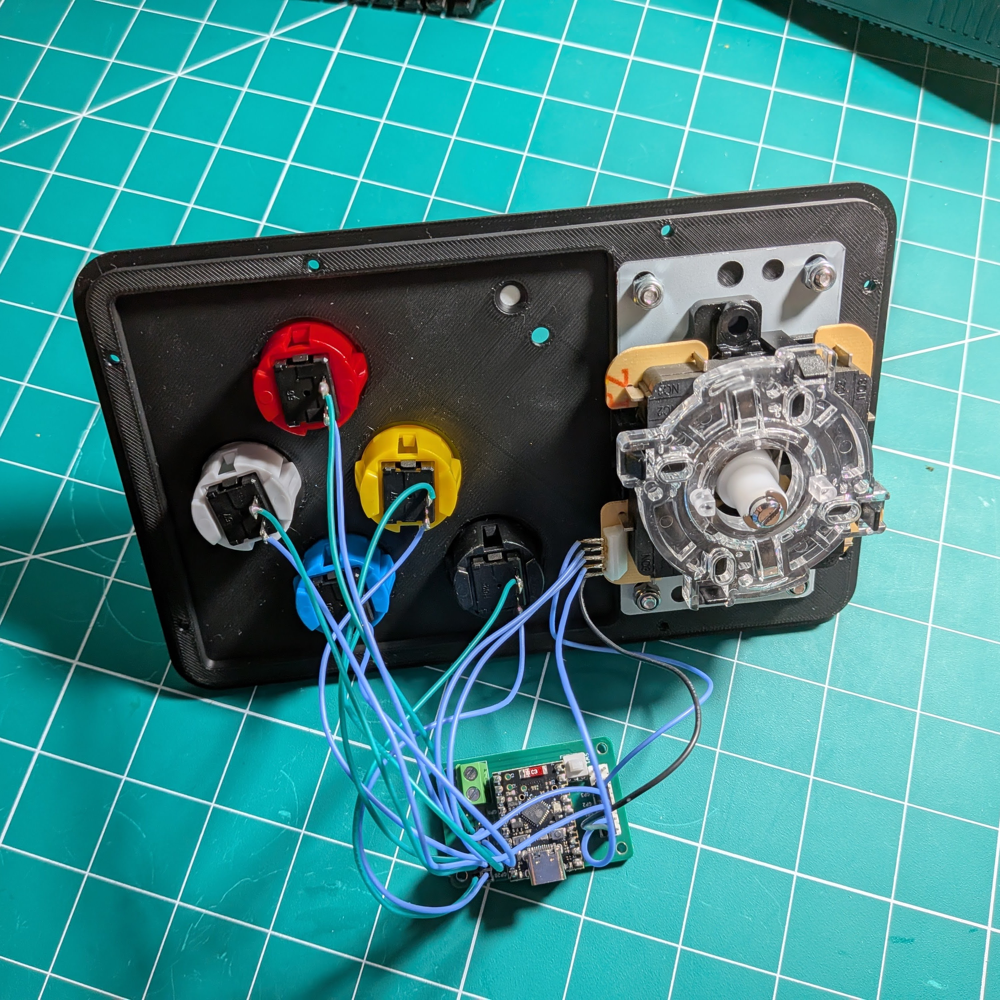

# Arcade Remote

A retro-style arcade controller for robots — a 4-way arcade joystick, five arcade buttons and an ESP32-C6, in a 3D-printed cabinet that fits in your hands.

 

**Jump to:** [Bill of Materials](#bill-of-materials) · [3D-Printed Parts](#3d-printed-parts) · [Assembly](#assembly) · [Firmware](#firmware) · [Controls](#controls) · [UDP Protocol](#udp-protocol) · [Troubleshooting](#troubleshooting)

<b>Table of Contents</b>

- [Introduction](#introduction)
  - [Specifications](#specifications)
- [Bill of Materials](#bill-of-materials)
  - [Electronics](#electronics)
  - [Connection Diagram](#connection-diagram)
  - [Pin Map](#pin-map)
  - [Other Parts](#other-parts)
- [3D-Printed Parts](#3d-printed-parts)
- [Assembly](#assembly)
- [Firmware](#firmware)
  - [Prerequisites](#prerequisites)
  - [Upload](#upload)
  - [Configuration](#configuration)
  - [Status LED](#status-led)
- [Controls](#controls)
- [UDP Protocol](#udp-protocol)
- [Troubleshooting](#troubleshooting)
- [Related Projects](#related-projects)
- [License](#license)
- [Support](#support)

## Introduction

This remote turns real arcade hardware into a WiFi controller for the [RookiDroid hexapod](https://github.com/rookidroid/hexapod) and any other robot that speaks the same binary UDP protocol.

- **Real arcade feel** — a microswitch joystick and five snap-in arcade buttons, no analog sticks and no deadzone
- **All-digital inputs** — nine switches on `INPUT_PULLUP` GPIOs, with no debounce logic needed because commands are re-sent continuously
- **WiFi direct to the robot** — the remote joins the robot's own access point, so no router is involved
- **20 Hz heartbeat** — the current command is sent every 50 ms, so releasing a control stops the robot right away
- **RGB status LED** — green when the link is up, red when it drops, visible through the window in the top panel
- **Battery powered** — a single 9 V battery in a magnetically-latched bay in the back
- **Fully 3D-printed cabinet** — one Bambu Studio project prints the whole enclosure

### Specifications

| Item | Value |
| ---- | ----- |
| **Controller** | ESP32-C6 SuperMini on the RookiDroid remote carrier board |
| **Inputs** | 4-way microswitch joystick + 5 arcade push buttons |
| **Feedback** | 1 × WS2812 (NeoPixel) RGB status LED on `GP8` |
| **Power** | 9 V battery → on-board Mini360 buck converter → 5 V, with a slide switch on the board |
| **Connectivity** | 2.4 GHz WiFi — the remote joins the robot's access point as a station |
| **Control** | 6-byte binary UDP packets to `192.168.4.1:1234` |
| **Update rate** | 20 Hz (50 ms loop), sent continuously including standby |
| **Enclosure** | 3D-printed body, cover, bottom plate and magnetic battery cover |

## Bill of Materials

### Electronics

| Name | Thumbnail | Required # | Specifications | Note |
| ---- | --------- | ---------- | -------------- | ---- |
| Controller board |  | 1 | ESP32-C6 SuperMini on a carrier board with a Mini360 buck converter, power switch, 2-pin battery terminal, a 5-pin joystick header (`GP0`–`GP3`) and a 2×7 button header | A bare ESP32-C6 SuperMini also works if you wire the switches straight to the GPIOs in the [pin map](#pin-map) and feed it 5 V |
| Arcade joystick |  | 1 | Microswitch joystick, 97 × 65 mm mounting plate, ~119 mm overall height, 5-pin harness | Ball top; the harness plugs into the joystick header |
| Arcade push button |  | 5 | 30 mm snap-in button with a microswitch (2 terminals) | Any five colors — four for the direction cluster, one for the special/modifier button |
| 9 V battery connector |  | 1 | Snap connector with flying leads | Screws into the 2-pin terminal block — mind the polarity |
| 9 V battery |  | 1 | Alkaline or rechargeable | Sits in the bay behind the magnetic cover |
| Jumper wires | — | ~11 | 2.8 mm spade or Dupont, 150–200 mm | One per button terminal; the joystick comes with its own harness |

### Connection Diagram

Every input is a plain switch to ground: the firmware enables the internal pull-ups, so one terminal goes to its signal pin and the other to any `GND` pin.

### Pin Map

| Input | Signal | GPIO | Where it lands on the board |
| ----- | ------ | ---- | --------------------------- |
| Joystick up | `JS_UP` | `GP3` | 5-pin joystick header |
| Joystick down | `JS_DOWN` | `GP2` | 5-pin joystick header |
| Joystick left | `JS_LEFT` | `GP0` | 5-pin joystick header |
| Joystick right | `JS_RIGHT` | `GP1` | 5-pin joystick header |
| Button — up | `BT_UP` | `GP14` | 2×7 button header |
| Button — down | `BT_DOWN` | `GP15` | 2×7 button header |
| Button — left | `BT_LEFT` | `GP18` | 2×7 button header |
| Button — right | `BT_RIGHT` | `GP19` | 2×7 button header |
| Button — special | `BT_SPECIAL` | `GP20` | 2×7 button header |
| Status LED | `PIN_RGB` | `GP8` | On-board WS2812 of the SuperMini |

The four direction buttons are the cluster outlined on the top panel; the button sitting on its own is the special (modifier) button.

### Other Parts

| Name | Spec | Required # | Installation |
| ---- | ---- | ---------- | ------------ |
| Screw | M3 10 mm | 8 | Cover to body |
| Nut | M3 | 8 | Cover to body |
| Screw | M4 10 mm | 4 | Joystick mounting plate |
| Nut | M4 | 4 | Joystick mounting plate |
| Screw | M2 4 mm | 4 | Controller board to body |
| Magnet | 6 mm dia. × 2 mm | 4 | Hold the battery cover |

## 3D-Printed Parts

The whole cabinet is one Bambu Studio project: [`3d model/arcade.3mf`](./3d%20model/arcade.3mf). The Fusion 360 source is [`3d model/arcade.f3d`](./3d%20model/arcade.f3d).

| Part | Required # | Note |
| ---- | ---------- | ---- |
| arcade body | 1 | Holds the controller board and the battery bay |
| arcade cover | 1 | Top panel with the joystick, button and LED cut-outs; multi-material, so the logo and outlines print in a second color |
| bottom | 1 | Closes the underside |
| battery cover | 1 | Magnetic latch, no screws |

**Print settings** (as saved in the project):

- Printer profile: Bambu Lab H2S, 0.4 mm nozzle
- Layer height: 0.2 mm
- Material: PLA
- Multi-color: the cover uses extra filaments for the logo and the button outlines — print it in a single color if you don't have an AMS

## Assembly

1. **Print the parts** and clean up the cut-outs — the buttons and the joystick shaft need a snug snap fit.
2. **Mount the inputs in the cover.** Snap the five buttons in, then bolt the joystick plate down with the M4 hardware.

   

3. **Mount the controller board** in the body on the M2 standoffs, with the USB-C port reachable for flashing.
4. **Wire it up.** Plug the joystick harness into the 5-pin header, then run one wire from each button to its GPIO on the 2×7 header and one to a `GND` pin — see the [connection diagram](#connection-diagram).
5. **Battery.** Screw the 9 V connector leads into the terminal block, minding polarity, and press the four magnets into the battery bay and its cover.
6. **Close it up** with the M3 screws and nuts, flash the [firmware](#firmware), and power it on.

## Firmware

The sketch lives in [`software/arcade/arcade.ino`](./software/arcade/arcade.ino).

### Prerequisites

- [Arduino IDE](https://www.arduino.cc/en/software) 2.x
- **esp32** board package 3.x or newer (Espressif Systems) — required for ESP32-C6 support
- **Adafruit NeoPixel** library

### Upload

1. Open `software/arcade/arcade.ino`.
2. Select **ESP32C6 Dev Module** as the board, and the port that appears when you plug in the USB-C cable.
3. Upload. If the port never enumerates, hold **BOOT**, tap **RESET**, release **BOOT**, and try again.
4. Open the Serial Monitor at **115200 baud** to watch the WiFi connection.

### Configuration

Edit these near the top of the sketch to match your robot:

| Setting | Default | Meaning |
| ------- | ------- | ------- |
| `ssid` | `hexapod_nougat` | The access point the robot hosts |
| `password` | `hexapod_1234` | Its passphrase |
| `udpAddress` | `192.168.4.1` | The robot's IP as the AP |
| `udpPort` | `1234` | UDP port the robot listens on |

`setup()` blocks until the robot's network is reachable, so power the robot up first.

### Status LED

| Color | Meaning |
| ----- | ------- |
| Off | Still connecting (or no power) |
| Green | Connected — commands are being sent |
| Red | WiFi lost; the sketch keeps running and recovers when the robot comes back |

## Controls

Every 50 ms the firmware reads all nine switches and sends exactly one command. Nothing pressed sends `CMD_STANDBY`, so the robot stops as soon as you let go.

**Joystick** (takes priority over the buttons):

| Joystick | Command | Action |
| -------- | ------- | ------ |
| Up | `CMD_WALK_0` | Walk forward |
| Down | `CMD_WALK_180` | Walk backward |
| Left | `CMD_WALK_L90` | Sidestep left |
| Right | `CMD_WALK_R90` | Sidestep right |
| Up + Left | `CMD_WALK_L45` | Walk forward-left |
| Up + Right | `CMD_WALK_R45` | Walk forward-right |
| Down + Left | `CMD_WALK_L135` | Walk backward-left |
| Down + Right | `CMD_WALK_R135` | Walk backward-right |

**Buttons** (when the joystick is centered):

| Button | Command | Action |
| ------ | ------- | ------ |
| Up | `CMD_WALK_0` | Walk forward |
| Down | `CMD_WALK_180` | Walk backward |
| Left | `CMD_TURN_LEFT` | Turn left in place |
| Right | `CMD_TURN_RIGHT` | Turn right in place |
| Special + Up | `CMD_ROTATE_X` | Body pitch |
| Special + Left | `CMD_ROTATE_Y` | Body roll |
| Special + Right | `CMD_ROTATE_Z` | Body yaw |
| Special + Down | `CMD_TWIST` | Body twist |

**Turbo:** hold the **up** button while pushing the joystick up for `CMD_FAST_FORWARD`, or the **down** button while pulling the joystick down for `CMD_FAST_BACKWARD`.

## UDP Protocol

Each packet is 6 bytes, little-endian and unpadded, sent to `192.168.4.1:1234`:

| Offset | Field | Type | Value |
| ------ | ----- | ---- | ----- |
| 0 | `magic` | `uint8` | `0xA5` — motion command |
| 1 | `cmd` | `uint8` | Command ID from the table below |
| 2–5 | `seq_num` | `uint32` | Increments on every packet |

| ID | Command | Sent by this remote |
| -- | ------- | ------------------- |
| 0 | `CMD_STANDBY` | Yes — nothing pressed |
| 1 | `CMD_WALK_0` | Yes |
| 2 | `CMD_WALK_180` | Yes |
| 3 | `CMD_WALK_R45` | Yes |
| 4 | `CMD_WALK_R90` | Yes |
| 5 | `CMD_WALK_R135` | Yes |
| 6 | `CMD_WALK_L45` | Yes |
| 7 | `CMD_WALK_L90` | Yes |
| 8 | `CMD_WALK_L135` | Yes |
| 9 | `CMD_FAST_FORWARD` | Yes — turbo |
| 10 | `CMD_FAST_BACKWARD` | Yes — turbo |
| 11 | `CMD_TURN_LEFT` | Yes |
| 12 | `CMD_TURN_RIGHT` | Yes |
| 13 | `CMD_CLIMB_FORWARD` | Not mapped to a control |
| 14 | `CMD_CLIMB_BACKWARD` | Not mapped to a control |
| 15 | `CMD_ROTATE_X` | Yes — special + up |
| 16 | `CMD_ROTATE_Y` | Yes — special + left |
| 17 | `CMD_ROTATE_Z` | Yes — special + right |
| 18 | `CMD_TWIST` | Yes — special + down |

The layout matches `UdpControlPacket` in the hexapod firmware — see the [hexapod UDP reference](https://github.com/rookidroid/hexapod#sending-udp-commands) for the other packet types the robot understands.

## Troubleshooting

| Symptom | Things to check |
| ------- | --------------- |
| LED stays off, Serial prints dots forever | The robot isn't powered up, or the SSID/password don't match — `setup()` waits for the AP |
| LED is green but the robot ignores the remote | `udpAddress` and `udpPort` must match the robot, and the robot must be in its normal (non-calibration) mode |
| One direction never triggers | Check that switch's signal wire and its `GND` — an unconnected `INPUT_PULLUP` pin just reads high forever |
| Diagonals don't work | The joystick has a 4-way restrictor plate fitted; swap in the 8-way gate |
| Robot keeps moving after you let go | Standby packets aren't arriving — check the WiFi link; the robot should also have its own failsafe |
| Board doesn't enumerate over USB | Hold **BOOT**, tap **RESET**, release **BOOT**, then upload |

## License

This project is licensed under the **MIT License** — see [LICENSE](./LICENSE) for the full text.

## Support

- Website: [rookidroid.com](https://rookidroid.com/)
- Email: [info@rookidroid.com](mailto:info@rookidroid.com)
- Bugs and build questions: [GitHub Issues](https://github.com/rookidroid/remote-arcade/issues)
